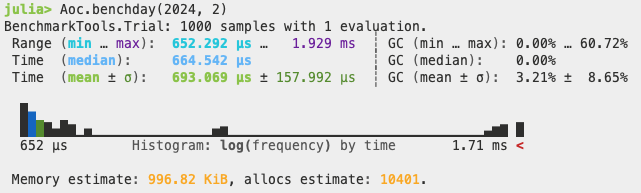

# Day 2 of 2024

Part 2 saves a bit of time by reusing the calculated distances and just calculating the new distance between the item that was removed. Storing the indexes of the unsafe distances and only testing those doesn't seem to  save any time with this particular dataset.

Benchmark running on M1 Max

