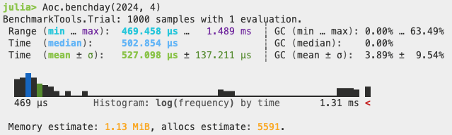

# Day 4 of 2024

Some optimisations that are typical for these matrix type puzzles:
- pad the matrix to avoid bounds test, while still limiting the loop to the original bounds
- convert to ints with sufficient distance between each so that we can use a sum to confirm that the four corners in part 2 contain 2 * M and 2 * S
- short circuit the tests in part 1 as soon as an invalid character is detected
- specific to this puzzle - part 2 is valid if the corners contain 2 * M and 2 * S **and** the diagonals do not contain the same value

Benchmark running on M1 Max

