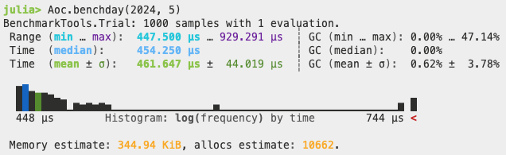

# Day 4 of 2024

A relatively simple day today. A custom sort function makes short work of the puzzle.

Some optimisations after revisiting the solution:
- Modify input parser to collect each line as it's read instead of splitting the input
- The page number are all 2 digits. That means we can convert the update string into an vector with a simple loop instead of using split
- Use a Set for the rule collection instead of a Dict
- Use partialsort to limit the sort to the middle page

Benchmark running on M1 Max

